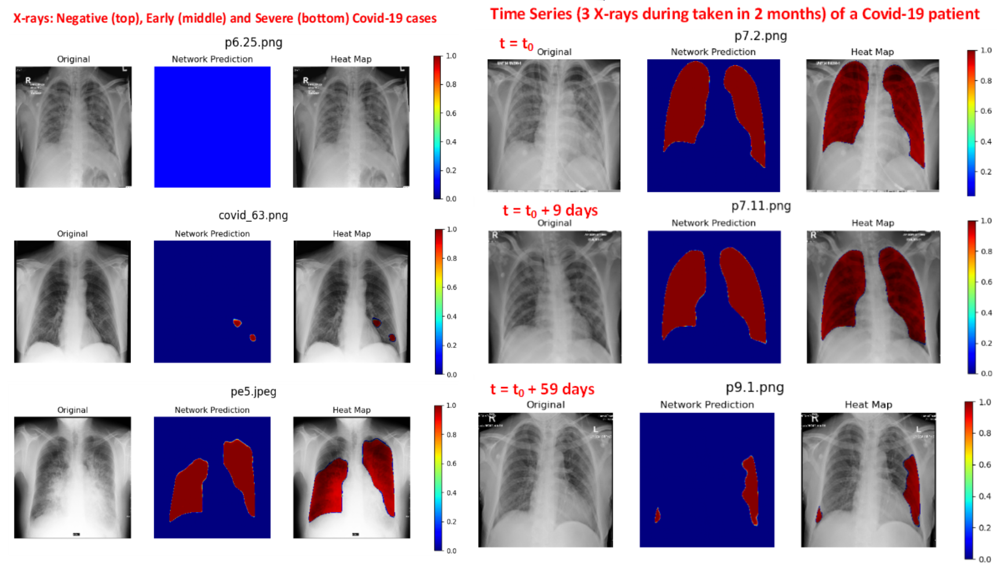
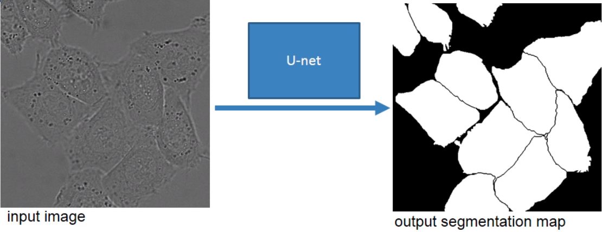
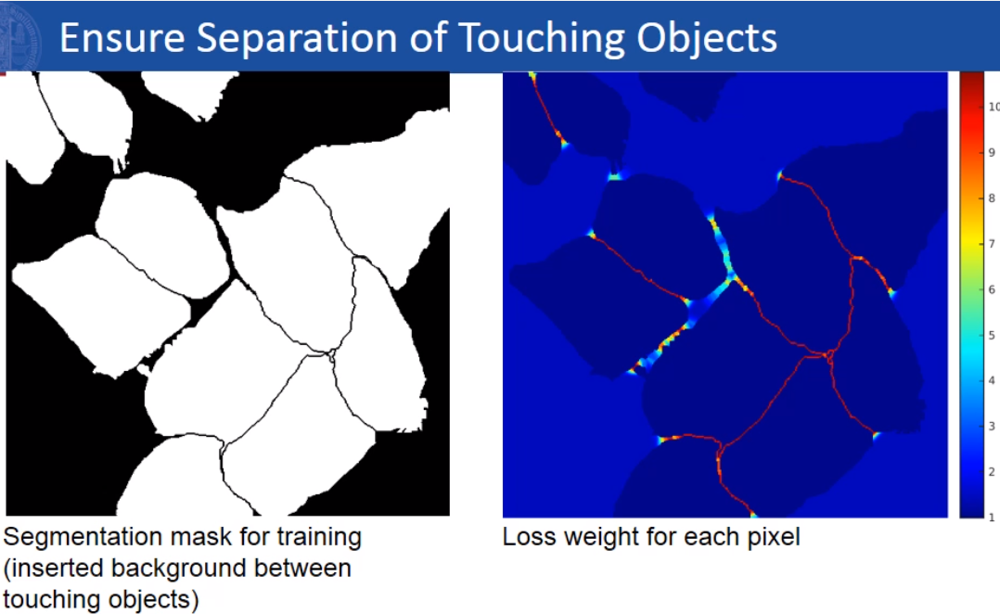
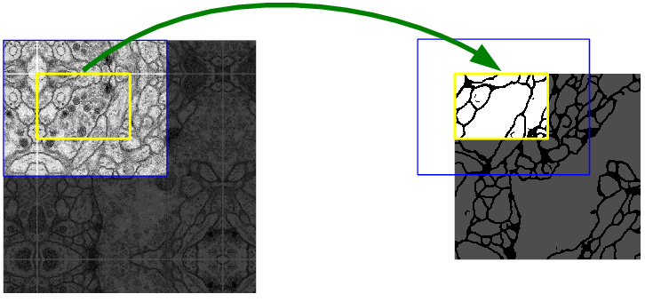
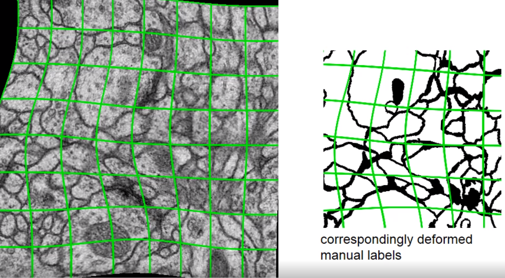

# U-Net_Lung-Segmentation
Application of U-Net in Lung Segmentation<br>

<br>
# Dataset
Download Dataset from [Chest Xray Masks and Labels Pulmonary Chest X-Ray Defect Detection](https://www.kaggle.com/nikhilpandey360/chest-xray-masks-and-labels)

```
  /data
    /data/Lung Segmentation
      /data/Lung Segmentation/CXR_Png
      /data/Lung Segmentation/masks
```

## U-Net: Convolutional Networks for Biomedical Image Segmentation 
Writers: Olaf Ronneberger, Philipp Fischer, and Thomas Brox <br>
Medical Image Computing and Computer-Assisted Intervention (MICCAI), Springer, LNCS, Vol.9351: 234--241, 2015, available at https://arxiv.org/pdf/1505.04597.pdf <br>
<br>
U-Net is a convolutional neural network architecture for fast and precise segmentation of images.<br>
<br>


## U-Net Architecture
<br>
U-net architecture (example for 32x32 pixels in the lowest resolution). Each blue box corresponds to a multi-channel feature map. The number of channels is denoted on top of the box. The x-y-size is provided at the lower left edge of the box. White boxes represent copied feature maps. The arrows denote the different operations.<br>
Note that there is no dense layer.So images of different sizes can be used as input.<br>


The U-Net combines **the location information from the downsampling** with **the contextual information in the upsampling** path to finally obtain a general information combining **localisation** and **context**, which is necessary to predict a good segmentation map.<br>

### Contracting path (Downsampling)
It consists of the repeated application of :<br>
- Two **3x3 convolutions** (unpadded convolutions) 
- Followed by a **ReLU** (Rectified Linear Unit) and Batch Normalization
- A **2x2 max pooling** operation with stride 2 for downsampling.<br>


### Expansive path (Upsampling)
Sequence of **up-convolutions** and **concatenation(skip-connection)** with high-resolution features from contracting path :<br>
- **2x2 convolution ("up-convolution")** that halves the number of feature channels
- A **concatenation** with the correspondingly cropped feature map from the contracting path
- Two **3x3 convolutions**
- Followed by a **ReLU** with Batch Normalization

### Final Bottleneck Layer
At the final layer a **1x1 convolution** is used to map each 64 componet feature vector to the desired number of classes.<br>


## Challenges
- Very few annotated Very few annotated images available (approx. 30 per applications)
- **Touching objects** of the same class<br>


## Contributions
- U-net learns **segmentation** in an **end-to-end** setting (beats the prior best method, a sliding-window CNN, with large margin.) 
- **excessive data augmentation** by applying **elastic deformations** which used to be the most common variation in tissue and realistic deformations can be simulated efficiently.
- Ensure Separation of Touching Objects

- The use of **a weighted loss**, where the separating background labels between **touching cells** of the same class
- Overlap-tile strategy for seamless segmentation of arbitrary large images

<br>
Important trick: select the input tile size such that all 2x2 max-pooling operations are applied to a layer with an even x- and y-size


## Data Augmentations
- shift
- rotation
- random elastic deformations:<br>
  smooth deformations using random displacement vectors on a coarse 3 by 3 grid.<br> 
  The displacements are sampled from a Gaussian distribution with 10 pixels standard deviation.<br>
  Per-pixel displacements are then computed using bicubic interpolation.
- Drop-out
